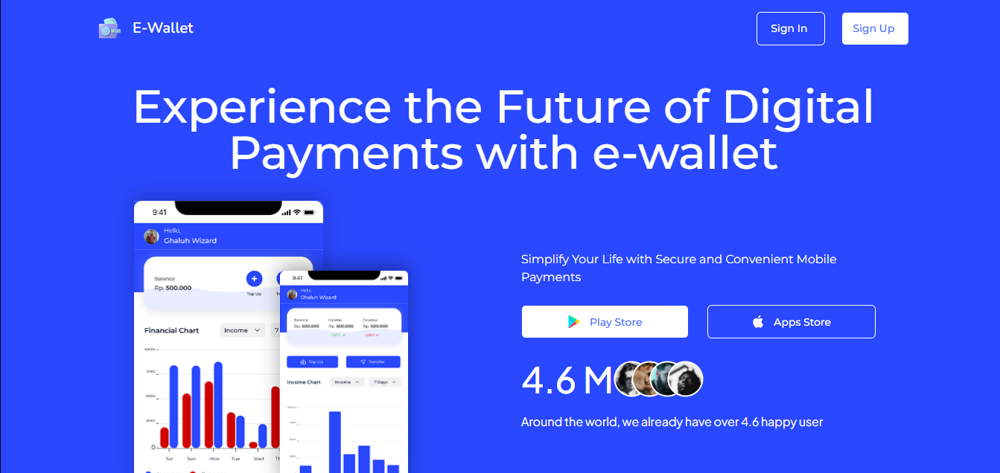

# 💳 Slicing CSS – E-Wallet WebApp

This project focuses on accurately slicing a UI design mockup with responsive layout, visual consistency, and interactive DOM behavior for E-Wallet app.

---

## 🛠️ Built With

- 🧱 **HTML5** – semantic and accessible structure  
- 🎨 **CSS3** – responsive layout using Flexbox & Grid  
- 📜 **JavaScript DOM** – basic interactivity without frameworks  
- 🔄 **Live Server** – for local development preview

---

## 📸 Preview



---

## 🚀 Getting Started (Local)

1. Clone this project:
```bash
git clone https://github.com/ranandasatria/fgo24-css-slicing
cd fgo24-css-slicing
```

2. Install the development server:
```bash
npm install
```

3. Start the live server:
```bash
npm run dev
```

4. Open your browser and go to:
```bash
http://localhost:8080
```


---

## 🐳 Optional: Running with Docker


1. Build the Docker image:
```bash
docker build -t ewallet-ui .
```

2. Run the container:
```bash
docker run --rm -d -p 8080:80 ewallet-ui
```

3. Open in your browser:
```bash
http://localhost:8080
```

---

## 📦 Dependencies

- **Live Server** – to simulate an HTTP server in a local environment.
- **Node.js** – required for npm-based commands.

---

## 🤝 How to Contribute

You're welcome to contribute:

1. Fork this repository.
2. Create a new branch:
```bash
git checkout -b feature-improvement
```
3. Make your changes and commit.
4. Push and open a Pull Request.

---

## 📄 License

This project is licensed under the [MIT License](LICENSE).

---

## 🏷️ Copyright

© 2025 Kodacademy. All rights reserved.
